# 🌿 Gläntan – A rental living concept

**🔗 Demo: https://tgvie.github.io/MI-design-to-code/**

This was part of an assignment where each team designed a website in Figma and then handed it off to another team for development. This project is the result of our team's effort to turn someone else's design into a fully functional website!

> "Gläntan is a nature-oriented housing concept where tranquility, the forest, and the lake take center stage. It’s a place designed for rest and recovery, with homes that blend into the surroundings and experiences that follow the rhythm of the forest. The design is inspired by Nordic simplicity – where every detail invites calmness and presence."

One of my proudest contributions to this project was animating the original logo, which added a fun and personalized touch to the final result!

| Original logo | Animated |
| ------------- | ---------|
|  | 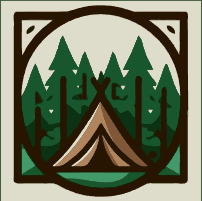 |

<strong>📐 Design</strong>

| Graphic Profile |
| --------------- |
| 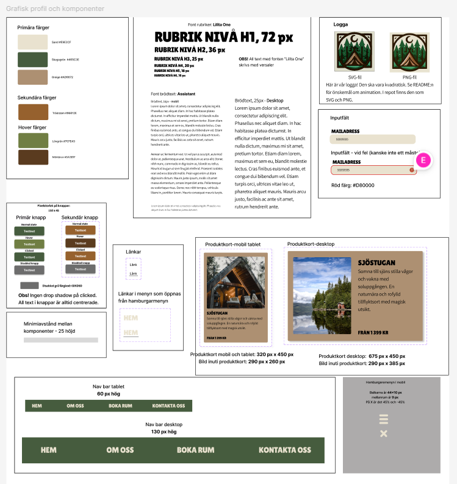 |

| Phone | Tablet | Desktop |
| ----- | ------ | ------- |
| 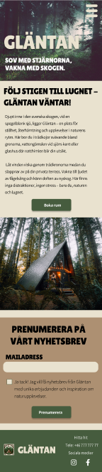 | 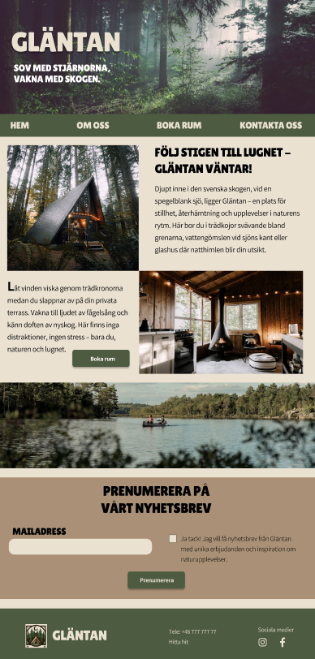 | 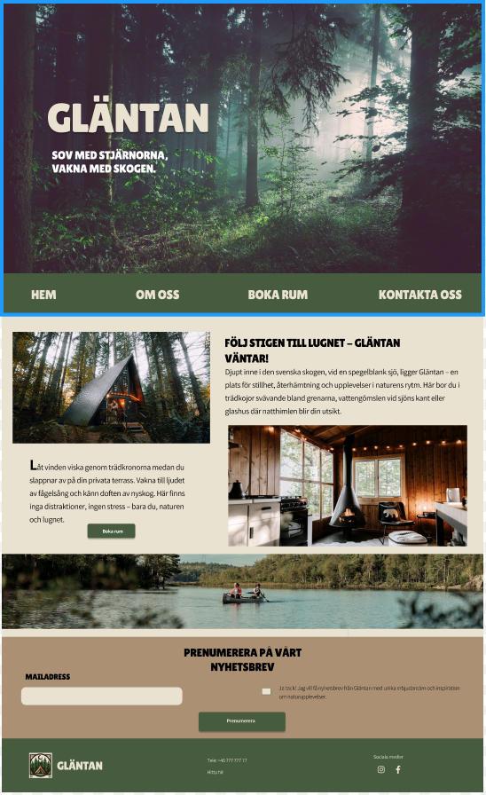 |
| 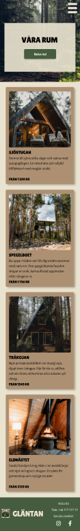 | 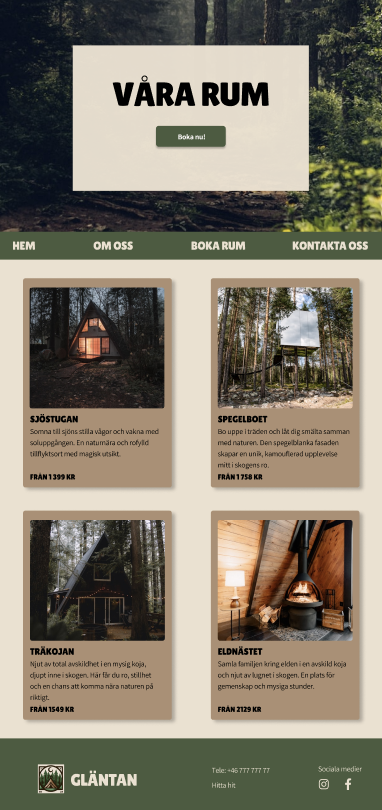 | 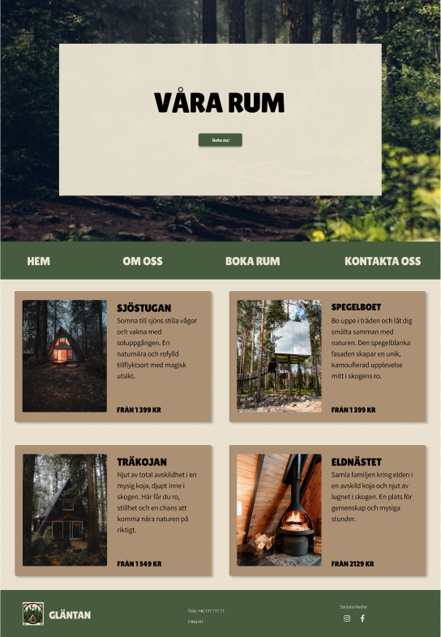 |

## 🖼️ Preview

| Phone | Tablet | Desktop |
| ----- | ------ | ------- |
| 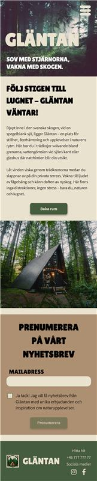 | 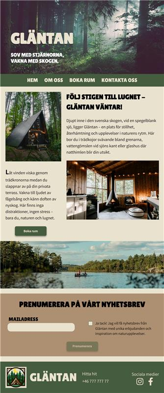 | 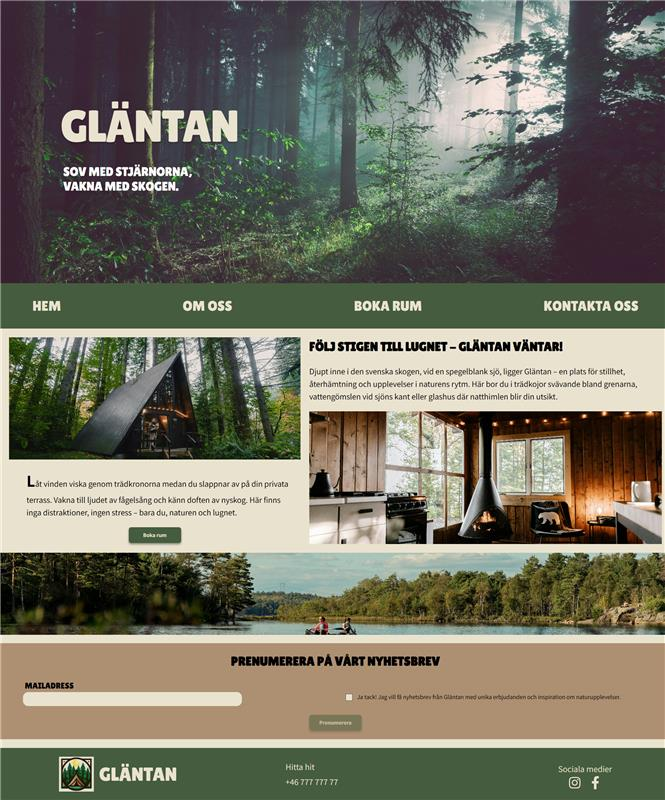 |

| Phone | Tablet | Desktop |
| ----- | ------ | ------- |
| 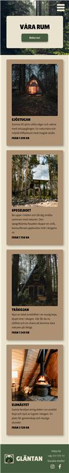 | 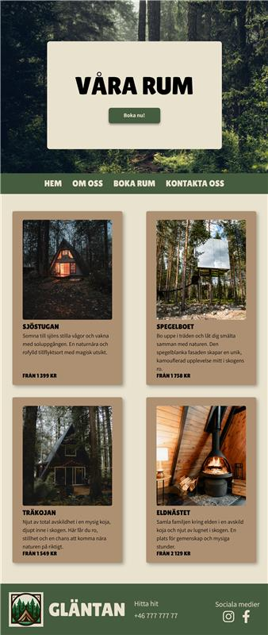 | 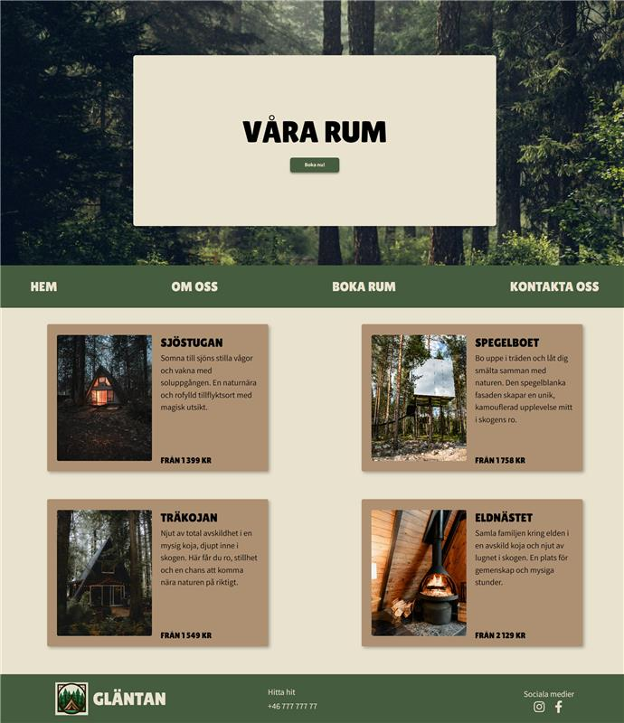 |

## 🛠️ Tech Stack

## 📋 Documentation

<strong>Lighthouse Report</strong>

| Desktop | Phone |
| ------- | ----- |
| 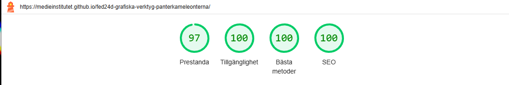 | 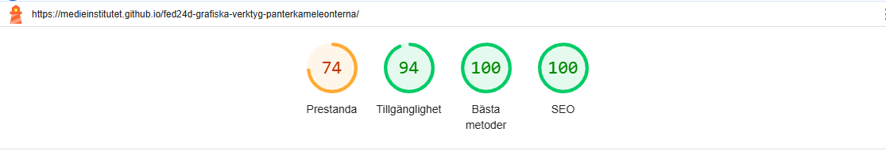 |
| 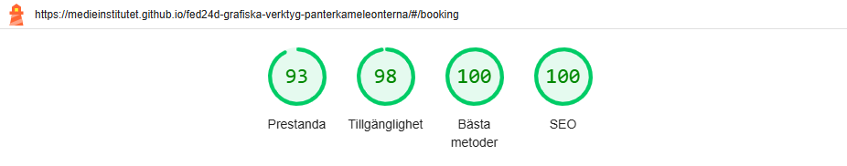 | 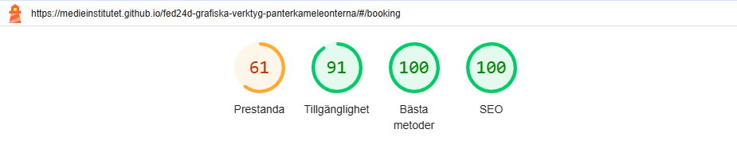 |

<strong>Code Validation</strong>

| HTML | CSS |
| ---- | --- |
| 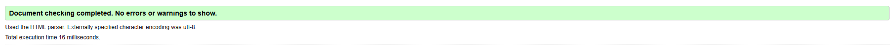 | 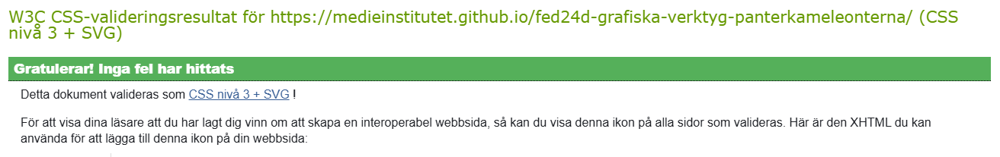 |
| 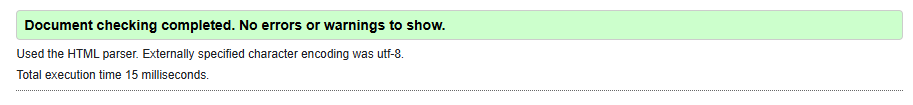 | 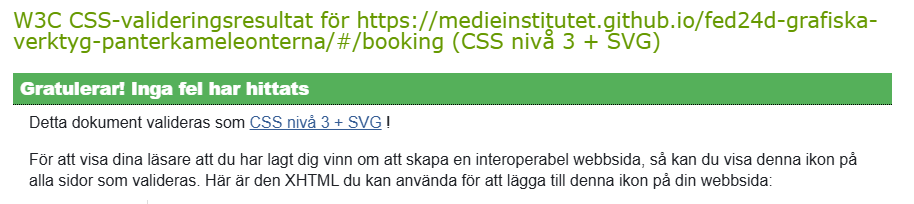 |

  
## ✍️ Author/s
| 🎨 Design's team | 🧑‍💻 Dev's team |
| ------------- | ---------- |
| [@axandranathalie](https://github.com/axandranathalie) | [@angien90](https://github.com/angien90) |
| [@ellinorjohansson](https://github.com/ellinorjohansson) | [@DavidBrunni](https://github.com/DavidBrunni) |
| [@KarinHson](https://github.com/KarinHson) | [@M-Lenvik](https://github.com/M-Lenvik) |
| [@TeaGross](https://github.com/TeaGross) | [@tgvie](https://github.com/tgvie) |

